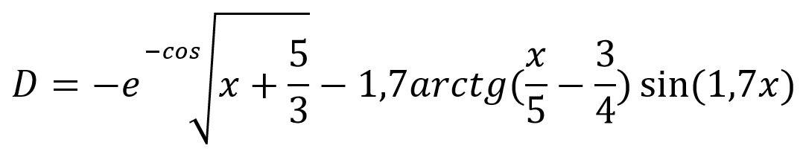
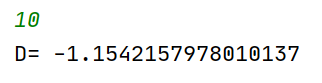
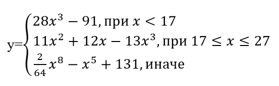
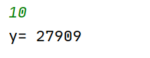
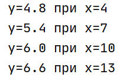
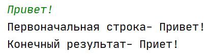
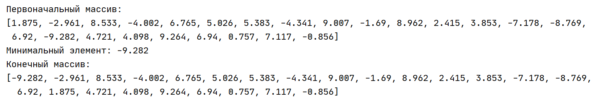
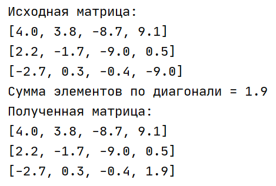

# Базовые алгоритмические конструкции
## 1. Линейный алгоритм
### Задание
Решить уравнение:

+ Входные данные: x
+ Выходные данные: D
### Скрипт
    import math
    D = "Не найден, x - не число"
    
    # Сохранение введенных данных
    input_value = str(input())
    
    # Проверка введенного значения
    if input_value.isdigit():
    x = int(input_value)
    
    # Уравнение для решения
    D = -math.exp(-math.cos(math.sqrt(x+5/3)))-1.7*math.atan(x/5-3/4)*math.sin(1.7*x)
    print("D= "+str(D))
    
### Пример

## 2. Линейный алгоритм с условиями
### Задание
Решить уравнение:

+ Входные данные: x
+ Выходные данные: y
### Скрипт
    import math
    y = "Не найден, x - не число"
    
    # Сохранение введенных данных
    input_value = str(input())
    
    # Проверка введенного значения
    if input_value.isdigit():
        x = int(input_value)
    
        # Условия
        if x < 17:
            y = 28*x**3 - 91
    
        elif 17 <= a <= 27:
            y = 11*x**2 +12*x - 13*x**3
    
        else:
            y = 1/64*x**8 - x**5 +131

    print("y= "+str(y))

### Пример
    

## 3. Линейный алгоритм с применением цикла
### Задание
Написать программу с использованием оператора цикла для вычисления значений у (y=x/5 +4), если х принадлежит заданному диапазону (3; 16), а значения х изменяется с шагом h=3.
+ Выходные данные: множество пар y;x.
### Скрипт
    import math
    y = 0
    # Цикл
    for x in range(4, 15, 3):
        y = x/5 +4
        print("y="+str(y)+ " при x="+str(x))
 
### Пример

## 4. Удаление серединного символа из нечетной по длине строки
### Задание
Ввести с клавиатуры строку символов. Программа должна определить длину введенной строки L, и, если длина L нечетная, то удаляется символ, стоящий посередине строки.
+ Входные данные: input_str - первоначальная строка
+ Выходные данные: input_str - первоначальная строка, new_str - полученная строка
### Скрипт
    # Сохранение введенных данных
    input_str = str(input())
    print("Первоначальная строка- "+input_str)
    
    # Проверка на нечетность
    if len(input_str) % 2 != 0:
        # Деление с получением целого значения
        middle_char = len(input_str) // 2
        # Удаление среднего символа
        new_str = input_str[:middle_char] + input_str[middle_char + 1:]
        print("Конечный результат- "+new_str)

### Пример
 

## 5. Поиск наименьшего элемента массива
### Задание
В массиве из 25 вещественных чисел найти наименьший элемент и поменять его местами с первым элементом.
+ Выходные данные: list_values - первоначальный массив, min - минимальный элемент, list_values - полученный массив (преобразованный первоначальный)
### Скрипт
    import random
    
    # Пустой список
    list_values = []
    # Цикл на заполнение массива чисел
    for i in range(24):
        list_values.append(round(random.uniform(-10,10), 3))
    
    # Печать первоначального массива
    print("Первоначальный массив:")
    print(list_values)
    
    # Предположим, что минимальный элемент равен list_values[0]
    min = first_value = list_values[0]
    index = 0
    
    # Цикл выбора наименьшего элемента
    for i in range(1, len(list_values)):
        if list_values[i] < min:
            min = list_values[i]
            index = i
    
    # Меняем местами
    print("Минимальный элемент: " + str(min))
    list_values[0] = min
    list_values[index] = first_value
    
    # Печать конечного массива
    print("Конечный массив:")
    print(list_values)

### Пример
 

## 6. Подсчет суммы элементов главной диагонали матрицы
### Задание
Дана матрица A(3,4). Найти сумму элементов главной диагонали и эту сумму поставить на место последнего элемента. Вывести исходную и полученную матрицу.
+ Выходные данные: array - первоначальная матрица, sum_diagonal - сумма элементов диагонали, array - полученная матрица (преобразованная первоначальная)
### Скрипт
    import random
    import numpy as np
    
    # Размерности матрицы
    n = 3
    m = 4
    # Пустой список
    array = []
    
    # Ф-ия вывода массива
    def print_array(self, caption=""):
        print(caption)
        for row in self:
            print(row)

    # Цикл на заполнение массива чисел
    # Заполнение строк матрицы
    for i in range(n):
        # Пустой список
        list_row = []
        # Заполнение столбцов матрицы
        for j in range(m):
            list_row.append(round(random.uniform(-10, 10), 1))
        array.append(list_row)
    
    # Печать матрицы
    print_array(array, caption="Исходная матрица:")
    
    # Получаем сумму элементов диагонали
    sum_diagonal = 0
    for x in range(0, len(array)):
        sum_diagonal = sum_diagonal + round(array[x][x], 1)
    print("Сумма элементов по диагонали = " + str(sum_diagonal))
    
    # Меняем значение крайнего элемента матрицы на сумму
    array[n-1][m-1] = sum_diagonal
    
    # Печать матрицы
    print_array(array, caption="Полученная матрица:")

### Пример
 